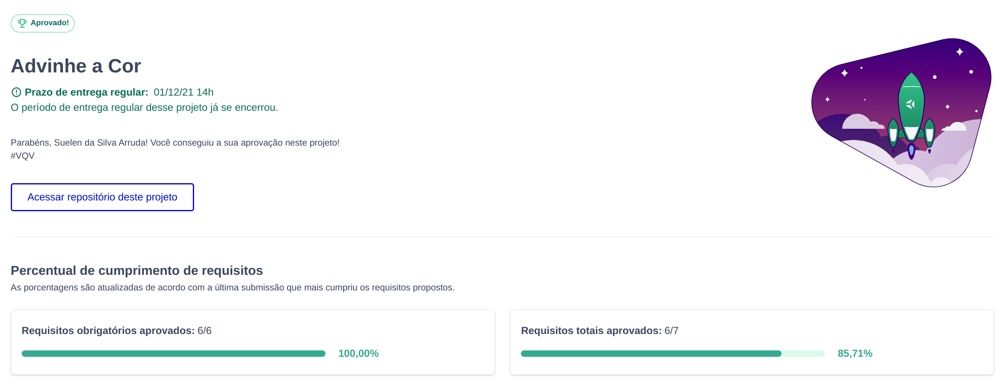

---

# Habilidades

- Manipular o DOM.

- Manipular o Javascript.

- Manipular o CSS.

---

## O que deverá ser desenvolvido

- Será desenvolvida uma aplicação utilizando JavaScript, HTML5 e CSS3.

- Nesta aplicação deverá ser possível jogar um jogo de adivinhação de cores e sua pontuação deverá atualizar de acordo com os acertos.

---

## Desenvolvimento

- Desenvolva uma aplicação de um jogo de adivinhação de cores.

---

## Stack utilizada

## 🔗 Links

## Status do projeto
